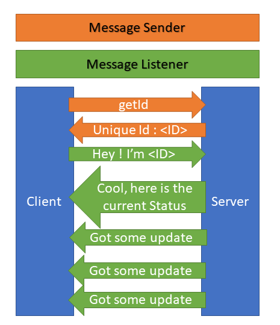
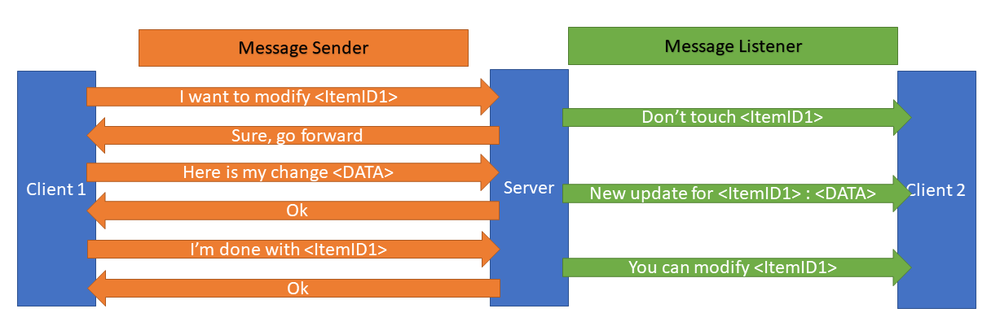

# sync-inventory
Proof of concept - using http stream to provide bidirectional communication to ensure data synchronicity

## Goal

The goal is to provide a way to multiple user to modify the same set of data and limit the collision that could arise. I've put as an example an inventory where multiple employee could modify it from multiple client.

## Disclaimer

That's a POC, it's not mean to be a solution, just a brainstorm about possibilities.

## Some diagrams

The handshake

Updating data

## Code structure

- on client side the fun is in [MessageListener](public/MessageListener.js), [MessageSender](public/MessageSender.js) and bind together in [DataStorage](public/DataStorage.js)
- on server side it's in [DataStore](server/DataStore.js)
- the tables are defined and initialised in router.js
- views/ contain the html templates for the table screens
- node.js/express/pug on server side
- materialize/jquery on client side

## Next steps

- make the server stateless by using a database and messaging system. (will be Reddis, because I'm lazy)
- add more type (date, double, integer)
- crush the bugs
